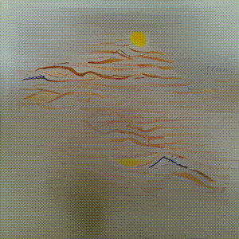

## VQGAN & CLIP
> Generating pictures with the use of
 VQGAN & CLIP as an input text is given

### first text was 
_"village landscape, made of lines sketch style river sun and trees"_

---

### second text was :
_"Transformation power of AI,  supercharged DNA of the new digital age challenge"_

---

---

Notebook generates images from text phrases with VQGAN and CLIP (Z + Quantize method with augmentations).

you dont need to give pictures to transfer styles from one to the other

Notebook initially was made by Katherine Crowson (https://github.com/crowsonkb, https://twitter.com/rivershavewings).
The Biggan + CLIP method was made by https://twitter.com/Advadnoun. Aggregated explanations, and modifications by Eleiber # 8347, and the friendly interface was made thanks to Abulafia # 3734.

All tributes to above authors I just went through to see how quickly new GAN CLIP etc models are taking over sphere of art.Similarly like crating videas was previously reserved for big studios nowaday everybody with access to internet and handy could do it.

### Contact
Checked by: _len.sla_

